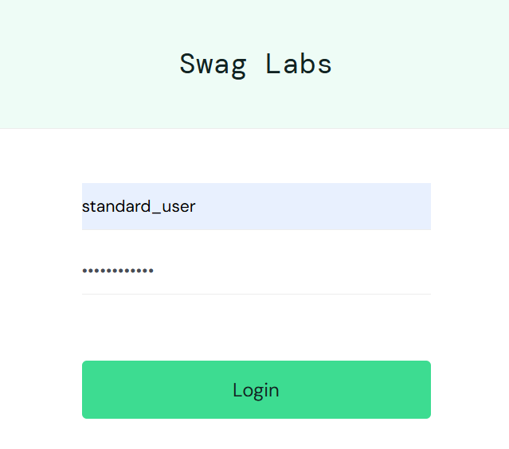
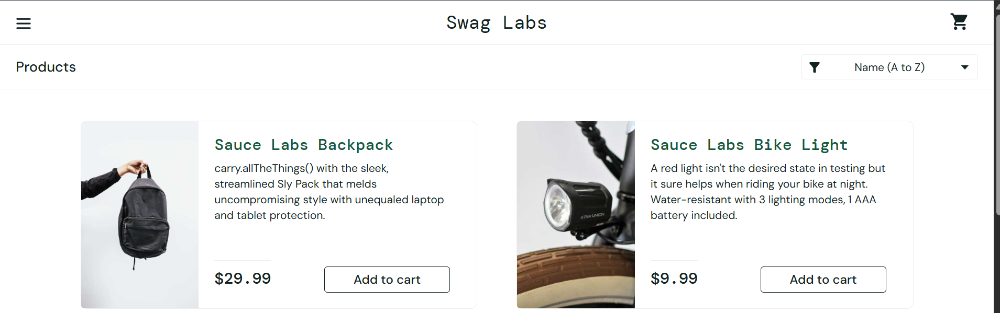
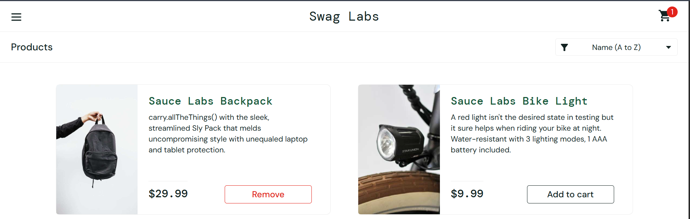
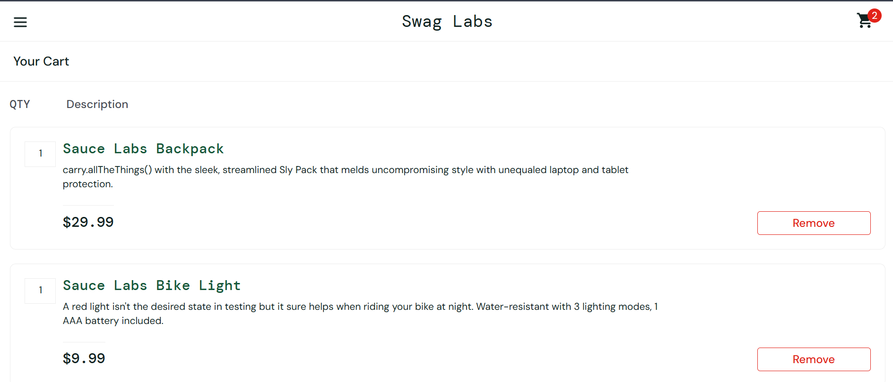

# QA Testing Portfolio

Este repositorio contiene ejemplos de prácticas de **QA Manual (Software Testing)** realizadas sobre una aplicación web de prueba.

El objetivo de este portfolio es demostrar habilidades básicas de testing utilizadas en proyectos de calidad de software.

---

# Aplicación probada

https://www.saucedemo.com/

Aplicación web de e-commerce utilizada comúnmente para prácticas de testing.

---

# Contenido del portfolio

## Test Cases

Diseño de casos de prueba para validar funcionalidades del sistema.

Archivos:

- test-cases/login-test-cases.md
- test-cases/cart-test-cases.md

---

## Bug Reports

Documentación de errores encontrados durante las pruebas.

Archivos:

- bug-reports/login-validation-bug.md

---

## Exploratory Testing

Notas de testing exploratorio para analizar el comportamiento del sistema.

Archivos:

- exploratory-testing/README.md

---

# Funcionalidades probadas

- Login de usuario
- Validación de credenciales
- Agregar productos al carrito
- Contador del carrito
- Visualización del carrito
- Eliminación de productos

---

# Tipos de testing realizados

- Functional Testing
- Manual Testing
- Exploratory Testing
- Bug Reporting

## Evidencia de pruebas

### Login exitoso

### Muestra productos

### Producto agregado al carrito

### Vista del carrito

### Productos agregados

